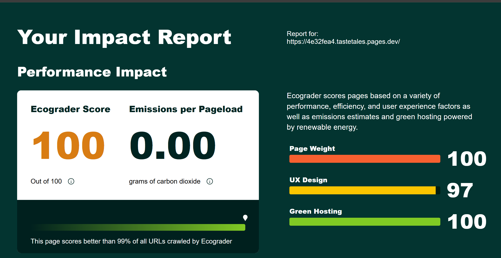

# Deployment-Vergleich: Hosting-Anbieter für statische Webseiten

## Ziel der Analyse
Verglichen werden gängige Hosting-Anbieter für statische Webseiten hinsichtlich:
- Kosten
- Einrichtung und Bedienung
- Geschwindigkeit (Performance)
- Git-Integration

Die Analyse dient der Auswahl eines geeigneten Dienstes für kleine bis mittelgrosse Webprojekte.

---

## Anbieter im Vergleich

| Anbieter             | Kosten     | Einrichtung     | Performance | Git-Anbindung       |
|----------------------|------------|------------------|-------------|---------------------|
| **GitHub Pages**     | Kostenlos  | Sehr einfach     | Gut         | Direkt integriert   |
| **Netlify**          | Kostenlos (Basis) | Sehr intuitiv     | Sehr gut    | Sehr gut (GitHub, GitLab) |
| **Cloudflare Pages** | Kostenlos  | Einfach          | Sehr schnell | Sehr gut (GitHub, GitLab) |
| **Vercel**           | Kostenlos  | Sehr einfach     | Exzellent   | Optimiert für Git   |
| **GitLab Pages**     | Kostenlos  | Komplexer Setup  | Gut         | Nativ für GitLab    |
| **Amazon S3**        | Bezahlt    | Technisch aufwendig | Exzellent   | Manuell             |
| **Google Cloud Storage** | Bezahlt | Komplex          | Exzellent   | Manuell             |

---

## Empfehlung
**GitHub Pages** wird als Hosting-Plattform empfohlen, weil:
- es vollständig kostenlos ist,
- keine zusätzliche Registrierung erforderlich ist (für GitHub-Nutzer),
- es einfach zu konfigurieren ist,
- GitHub als Versionskontrolle ohnehin genutzt wird,
- und es sich ideal für reine HTML-, CSS- und JS-Seiten eignet.

Wir haben uns daher entschieden, **GitHub Pages** als Hosting-Lösung für unser Projekt *Taste Tales* zu verwenden.

Die Website *Taste Tales* ist ein rein statisches Projekt mit HTML-, CSS- und Markdown-Dateien. Es werden keine serverseitigen Funktionen, Benutzerauthentifizierung oder Datenbanken benötigt. Da das Projekt ohnehin mit GitHub entwickelt wird, ist die native Integration von GitHub Pages besonders vorteilhaft. Dies reduziert den Konfigurationsaufwand, vermeidet externe Abhängigkeiten und ermöglicht ein einfaches, sicheres und kostenloses Deployment direkt aus dem Repository heraus.

---

## Ergänzung: Green Hosting via Cloudflare Pages

Da **GitHub Pages kein „Green Hosting“** unterstützt, wurde zusätzlich eine zweite Deployment-Instanz über **Cloudflare Pages** aufgesetzt.  
Cloudflare nutzt nachweislich zu 100% erneuerbare Energiequellen und verbessert damit die ökologische Nachhaltigkeit des Projekts.

👉 Dadurch konnte im Tool **Ecograder** ein höherer Score erzielt werden, insbesondere in der Kategorie „Green Hosting“.

📸 Screenshot der Analyse:
-

---

## Quellenverzeichnis

- GitHub Pages: https://docs.github.com/en/pages (Zugriff: 05.05.2025)
- Netlify Docs: https://docs.netlify.com (Zugriff: 05.05.2025)
- Cloudflare Pages: https://developers.cloudflare.com/pages (Zugriff: 05.05.2025)
- GitLab Pages: https://docs.gitlab.com/ee/user/project/pages/ (Zugriff: 05.05.2025)
- Vercel Docs: https://vercel.com/docs (Zugriff: 05.05.2025)
- AWS S3: https://docs.aws.amazon.com/AmazonS3/latest/userguide/WebsiteHosting.html (Zugriff: 05.05.2025)
- Google Cloud Hosting: https://cloud.google.com/storage/docs/hosting-static-website (Zugriff: 05.05.2025)

> Hinweis: Dieser Text wurde unter Zuhilfenahme von OpenAI ChatGPT (GPT-4, Mai 2025) erstellt.  
> Die Aussagen basieren auf offiziellen Dokumentationen und technischen Quellen, die im Quellenverzeichnis aufgeführt sind.