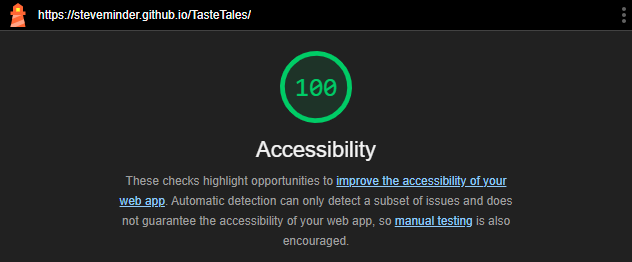

# 🍴 Taste Tales – Lieblingsrezepte Website

> Semesterprojekt im Lehrgang NDS HF Applikationsentwicklung, Teko Bern  
> Gruppenarbeit von **Steve Minder** und **Florian Zingg**  
> Erstellt im Rahmen des Moduls **Web Engineering**

---

## 🔍 Projektübersicht

Taste Tales ist eine statische Rezepte-Website, aufgeteilt in die Kategorien:
- Vorspeisen
- Hauptgerichte
- Desserts
- Gebäck

Ziel ist es, Inhalte wie Rezepte strukturiert darzustellen, Markdown sinnvoll zu verwenden und das Projekt barrierefrei, responsive und nachhaltig zu gestalten.  
Langfristig soll **Taste Tales** als **digitale Plattform zum Austausch von Rezepten zwischen Freunden und Familienmitgliedern** dienen – einfach, zugänglich und inspirierend.

📄 Die Anforderungen an das Projekt basieren auf dem offiziellen [Projektauftrag Web-Engineering](./Projektauftrag.md).

## 🧭 Technologien und Tools

| Komponente         | Wahl                                    |
|--------------------|-----------------------------------------|
| **SSG**            | Eleventy (11ty)                         |
| **Hosting**        | GitHub Pages                            |
| **Sprache**        | HTML5, CSS3, Markdown                   |
| **Editor**         | WebStorm                                |
| **Versionskontrolle** | Git & GitHub                         |

---

## 🔎 Variantenentscheide

Im Rahmen des Projekts *Taste Tales* wurden zwei zentrale technische Entscheidungen analysiert und dokumentiert:

- 📦 **Deployment-Strategie (Hosting statischer Seiten)**  
  Nach einem Vergleich mehrerer Anbieter fiel die Wahl auf **GitHub Pages** aus folgenden Gründen:
    - vollständig kostenlos
    - direkt in GitHub integriert
    - keine zusätzliche Registrierung notwendig
    - ideal für statische Projekte mit HTML, CSS und Markdown
    - einfaches, sicheres Deployment direkt aus dem Repository  
      👉 Siehe [Deployment-Vergleich](./Deployment.md)

- ⚙️ **Static Site Generator (SSG)**  
  Wir entschieden uns für **Eleventy (11ty)**, da es folgende Vorteile bietet:
    - basiert auf JavaScript und ist leichtgewichtig
    - nativ Markdown-kompatibel
    - flexible Verzeichnisstruktur und Template-Unterstützung (z. B. Nunjucks)
    - einfach zu konfigurieren
    - sehr gut kombinierbar mit GitHub Pages  
      👉 Siehe [SSG-Vergleich](./StaticSiteGenerator.md)

---

## ✅ HTML & CSS Validierung

Im Rahmen des Projekts wurden die HTML- und CSS-Dateien mit offiziellen W3C-Validatoren geprüft. Die folgenden Links ermöglichen eine direkte Analyse der Live-Version:

- 🔗 [HTML Validator – Startseite](https://validator.w3.org/nu/?doc=https%3A%2F%2Fsteveminder.github.io%2FTasteTales%2F)
- 🔗 [CSS Validator – style.css](https://jigsaw.w3.org/css-validator/validator?uri=https%3A%2F%2Fsteveminder.github.io%2FTasteTales%2Fcss%2Fstyle.css&profile=css3svg&usermedium=all&warning=1&vextwarning=&lang=de)

### 🔍 Funktionsweise der Validierung

Die oben verlinkten Tools analysieren öffentlich zugängliche Dateien auf **technische Korrektheit**:

- Der **HTML-Validator** überprüft die Struktur, Semantik und Syntax der HTML-Dateien nach dem W3C-Standard.
- Der **CSS-Validator** analysiert das Stylesheet `style.css` auf Regelkonformität und Warnungen.

Die Links enthalten bereits die URL zur live veröffentlichten Website auf GitHub Pages. Mit einem Klick wird automatisch eine Prüfung durchgeführt – ohne dass die Dateien manuell hochgeladen werden müssen.

# 🌱 Nachhaltigkeitsprüfung mit Ecograder

Zur Bewertung der ökologischen Qualität wurde das Online-Tool **Ecograder** verwendet. Es analysiert Aspekte wie den Energieverbrauch, die Seitengrösse und allgemeine Nachhaltigkeitsfaktoren der Website.

👉 Eine aktuelle Bewertung kann direkt auf [ecograder.com](https://ecograder.com) durchgeführt werden, indem die URL `https://steveminder.github.io/TasteTales/` eingegeben wird.

### 🔍 Überblick zur Analyse

Ecograder beurteilt Webseiten unter anderem anhand von:

- Effizienz bei Ladezeit und Dateigrösse
- Optimierung der technischen Umsetzung
- Hosting-Nachhaltigkeit
- Reduktion unnötiger Ressourcen

Die Bewertung erfolgt mit einem Score von 0 bis 100.  
Unser Ziel war ein **Ecograder Index von über 90 Punkten**, was mit einer optimierten Umsetzung angestrebt wurde.

---

## ♿ Barrierefreiheitstest

Die Barrierefreiheit der Website wurde mit dem integrierten Analyse-Tool **Google Chrome Lighthouse** überprüft.  
Dabei wurde ein **Score von 100% in der Kategorie „Accessibility“** erreicht – ein Beleg für eine benutzerfreundliche und zugängliche Gestaltung.

📸 Beispielauswertung: 
-

---

## ✍️ Rezepte via GitHub-Issues einreichen

Über das GitHub-Issue-System können neue Rezeptvorschläge bequem und strukturiert eingereicht werden.  
Dazu steht eine **vorbereitete Vorlage** zur Verfügung, die Nutzer:innen Schritt für Schritt durch die benötigten Angaben führt.

👉 Einfach unter dem Reiter **Issues** auf „New issue“ klicken.

Alle eingereichten Vorschläge können später durch das Projektteam geprüft und direkt in die Website integriert werden.  
So wird die Plattform kollaborativ erweiterbar – ideal für Klassenprojekte, Freundeskreise oder Familienrezepte.

---

## ℹ️ Quellenverzeichnis

- W3C HTML Validator: https://validator.w3.org/ (Zugriff: 08.05.2025)
- W3C CSS Validator: https://jigsaw.w3.org/css-validator/ (Zugriff: 08.05.2025)
- Ecograder: https://ecograder.com/ (Zugriff: 08.05.2025)
- Eleventy Docs: https://www.11ty.dev/docs/ (Zugriff: 08.05.2025)
- GitHub Pages Docs: https://docs.github.com/en/pages (Zugriff: 08.05.2025)
- Markdown Guide: https://www.markdownguide.org/basic-syntax/ (Zugriff: 08.05.2025)
- WCAG Richtlinien: https://www.w3.org/WAI/standards-guidelines/wcag/ (Zugriff: 08.05.2025)
- MDN Web Docs – HTML: https://developer.mozilla.org/en-US/docs/Web/HTML (Zugriff: 08.05.2025)
- MDN Web Docs – CSS: https://developer.mozilla.org/en-US/docs/Web/CSS (Zugriff: 08.05.2025)

> Hinweis: Dieser Text wurde unter Zuhilfenahme von OpenAI ChatGPT (GPT-4, Mai 2025) erstellt.  
> Die Aussagen basieren auf offiziellen Dokumentationen und technischen Quellen, die im Quellenverzeichnis aufgeführt sind.